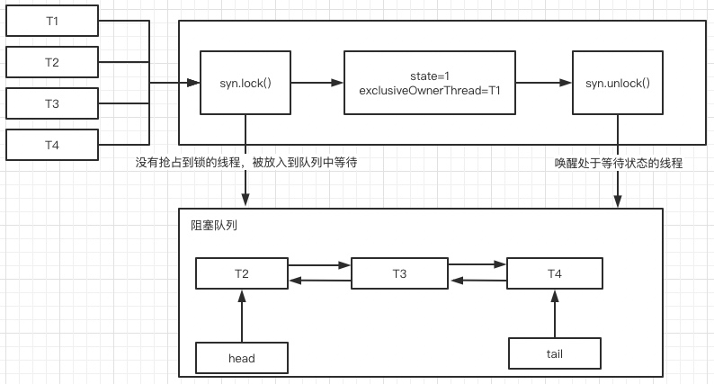

# JUC中的重入锁 - ReentrantLock

 在JUC中有一个`Lock`接口，功能和`synchronized`是类似，都是用于保证线程安全性, 与`synchronized`不一样的是，`Lock`接口提供了加锁和释放锁的方法，需要开发者使用这两种类型的方法去保证线程安全性，它无法像`synchronized`一样，自动加锁与释放锁。
 ```java
 public interface Lock {
    // 用于抢占资源，如果抢占不到资源，则进入阻塞状态
    void lock();

    // 在等待资源时，可以被其他线程中断
    void lockInterruptibly() throws InterruptedException;

    // 尝试抢占锁资源，如果抢占到锁，则进入返回true，否则返回false
    boolean tryLock();

    // 尝试抢占锁，如果抢占到锁，则返回true，如果抢占不到，则会等待一段时间，
    // 当等待时间结束后仍抢占不到锁，则返回false
    boolean tryLock(long time, TimeUnit unit) throws InterruptedException;
    
    // 释放锁资源
    void unlock();

    // 返回Condition对象，用于线程间的通信，后续会讲到JUC中的具体实现
    Condition newCondition();
}
 ```
 `Lock`接口在JUC中有以下的具体实现:
 - ReentrantLock:重入锁，属于排他类型锁（重量级）
 - ReentrantReadWriteLock: 可重入读写锁，主要体现在该类中维护了两个锁，`ReadLock`和`WriteLock`
 - StampedLock：ReentrantReadWriteLock的改进版，Java 8 引入； 

 ### ReentrantLock的基本应用
`ReentrantLock`，顾名思义，是一个支持重入的排他锁，排他锁在前面相信大家都已经理解，那什么是重入呢？
重入的意思是，如果一个线程已经获得锁资源了，后续再抢占相同的锁资源时，不需要再加锁，但需要记录重入次数，并且加锁的次数与释放锁的次数需要相等，否则抢占到锁的线程无法及时释放锁资源，从而进入死锁的状态。前面学到的`synchronized`也是重入锁。接下来演示一下`ReentrantLock`的应用
```java
 private static Lock lock = new ReentrantLock();

    private static int count = 0;

    public static void main(String[] args) {

        List<Future> taskList = new ArrayList<>();
        for (int i = 0; i < 1000; i++) {
            FutureTask task = new FutureTask(() -> {
                // 加锁
                lock.lock();
                try {
                    count++;
                } finally {
                // 释放锁
                    lock.unlock();
                }
                return 1;
            });
            taskList.add(task);
            new Thread(task).start();
        }

        taskList.stream().forEach(future -> {
            try {
                future.get();
            } catch (InterruptedException e) {
                e.printStackTrace();
            } catch (ExecutionException e) {
                e.printStackTrace();
            }
        });

        System.out.println(count);
    }
```
 上面的例子中，使用`ReentrantLock`的`lock()`方法和`unlock()`方法，对非原子操作`count++`进行加锁，保证其在多线程下的线程安全性。

### ReentrantLock原理解析
通过`ReentrantLock`的`lock()`方法，可以看到，它是通过`sync.lock()`来进行加锁的。
```java
public void lock() {
    sync.lock();
}
```
而`sync`是在`ReentrantLock`中定义的一个内部抽象类，它继承了`AbstractQueuedSynchronizer`抽象类，并且两个实现类，`FairSync（公平锁）`和`NonfairSync（非公平锁）`。首先我们先从`AbstractQueuedSynchronizer (AQS)`讲起。

#### AbstractQueuedSynchronizer （AQS）
在JUC中，大部分组件都依赖于AQS，它提供了两种锁的实现
- 独占锁：同一时刻只能有一个线程获得锁
- 共享锁：同一时刻允许多个线程同时获得锁，

在AQS中，维护了一个变量`state`，表示共享资源，并提供了CAS操作方法来改变`state`的值。
- state = 0: 表示当前资源空闲
- state > 0: 表示有线程争抢到资源并未释放，重入情况下，state可能大于1。
```java

    /**
     * The synchronization state.
     */
    private volatile int state;
    
    protected final boolean compareAndSetState(int expect, int update) {
        // stateOffset是state变量的内存地址
        return unsafe.compareAndSwapInt(this, stateOffset, expect, update);
    }
```

AQS是一个抽象类，它本身是一个线程队列，并且已经实现了线程等待队列的维护和唤醒机制，我们可以通过图来理解。


当多个线程（T1,T2,T3,T4）去争抢锁时（调用AQS提供的抢占方法针对`state`变量进行CAS设值），抢占不到锁的线程会被放到阻塞队列中进行等待，当抢占到锁的线程（T1）执行完成后，会唤醒阻塞队列中的线程，让它们再重新去争抢锁，这个操作已经在AQS中实现。
在使用AQS时，需要继承它并实现其提供的方法，来实现对`state`变量的获取和释放，具体有以下方法：
- tryAcquire(int)：以独占的方式尝试获取资源，成功则返回true，失败则返回false。
- tryRelease(int)：以独占的方式尝试释放资源，成功则返回true，失败则返回false。
- tryAcquireShared(int)：以共享的方式尝试获取资源，负数表示失败；0表示成功，但没有剩余可用资源；正数表示成功，且有剩余可用资源。
- tryReleaseShared(int)：以共享的方式尝试获取资源，如果释放后允许唤醒后续等待节点则返回true，否则返回false。

#### ReentrantLock源码分析

了解了AQS的基本原理，接下来看看`ReentrantLock`的源码，了解其是如何利用AQS来保证线程安全性的。
```java

    /**
     * Creates an instance of {@code ReentrantLock}.
     * This is equivalent to using {@code ReentrantLock(false)}.
     */
    public ReentrantLock() {
        sync = new NonfairSync();
    }

    /**
     * Creates an instance of {@code ReentrantLock} with the
     * given fairness policy.
     *
     * @param fair {@code true} if this lock should use a fair ordering policy
     */
    public ReentrantLock(boolean fair) {
        sync = fair ? new FairSync() : new NonfairSync();
    }
```
`ReentrantLock`有两个构造方法，可以选择选择公平锁或者非公平锁，默认会初始化非公平锁。

##### ReentrantLock.lock()
```java
public void lock() {
    sync.lock();
}
```
可以看到，`lock()`方法是使用同步器`sync`的`lock()`方法，而`sync`有`FairSync`和`NonfairSync`两种实现，这里以默认的`NonfairSync`非公平锁为例，进入其`lock()`方法，
```java
/**
 * Performs lock.  Try immediate barge, backing up to normal
 * acquire on failure.
 */
final void lock() {
    // 对AQS中的state变量进行CAS设值
    if (compareAndSetState(0, 1))
        setExclusiveOwnerThread(Thread.currentThread());
    else
    // 设置失败，说明抢占不到锁
        acquire(1);
}
```
可以很直观的看到，在`sync.lock()`方法里，使用了`compareAndSetState(0,1)`进行CAS设值，如果设置成功，则将当前线程设置到`AQS`的`exclusiveOwnerThread`全局变量中，表明当前线程抢占到锁资源，而`compareAndSetState(0,1)`同样也是`AQS`提供的方法，在这个方法里，会对上面提到的`state`变量进行CAS设值，如果成功，则返回true。
```java
/**
 * Atomically sets synchronization state to the given updated
 * value if the current state value equals the expected value.
 * This operation has memory semantics of a {@code volatile} read
 * and write.
 *
 * @param expect the expected value
 * @param update the new value
 * @return {@code true} if successful. False return indicates that the actual
 *         value was not equal to the expected value.
 */
protected final boolean compareAndSetState(int expect, int update) {
    // See below for intrinsics setup to support this
    return unsafe.compareAndSwapInt(this, stateOffset, expect, update);
}
```

如果抢占失败，则会走`acquire(1)`方法
```java
/**
 * Acquires in exclusive mode, ignoring interrupts.  Implemented
 * by invoking at least once {@link #tryAcquire},
 * returning on success.  Otherwise the thread is queued, possibly
 * repeatedly blocking and unblocking, invoking {@link
 * #tryAcquire} until success.  This method can be used
 * to implement method {@link Lock#lock}.
 *
 * @param arg the acquire argument.  This value is conveyed to
 *        {@link #tryAcquire} but is otherwise uninterpreted and
 *        can represent anything you like.
 */
public final void acquire(int arg) {
    if (!tryAcquire(arg) &&
        acquireQueued(addWaiter(Node.EXCLUSIVE), arg))
        selfInterrupt();
}
```
可以看到，在`acquire(int)`方法中，会调用`tryAcquire(arg)`重新抢占一次锁，如果抢占不到才会调用将线程添加到等待队列中。而`tryAcquire(arg)`方法是AQS提供的方法，需要子类去实现，所以我们可以去`NonfairSync`类中查看此方法，会发现它又调用了`NonfairSync(acquires)`方法。
```java
/**
 * Performs non-fair tryLock.  tryAcquire is implemented in
 * subclasses, but both need nonfair try for trylock method.
 */
final boolean nonfairTryAcquire(int acquires) {
    final Thread current = Thread.currentThread();
    // 拿到AQS中state变量值
    int c = getState();
    // state等于0，表明当前没有线程在占有资源，可以争抢
    if (c == 0) {
        if (compareAndSetState(0, acquires)) {
            setExclusiveOwnerThread(current);
            return true;
        }
    }
    // 当前线程等于占有资源的线程，表明是线程重入
    else if (current == getExclusiveOwnerThread()) {
        int nextc = c + acquires;
        if (nextc < 0) // overflow
            throw new Error("Maximum lock count exceeded");
        setState(nextc);
        return true;
    }
    return false;
}
```
在`nonfairTryAcquire()`方法中，会先拿到AQS中的`state`变量，如果`state`等于0，表明当前没有线程在占有资源，可以去争抢资源，这也是非公平的体现，抢占的方式还是直接通过CAS对`state`变量设置，如果设置成功，则设置独占线程信息。
如果`state`变量不等于0，表明已经有线程占有资源，则判断是否为重入线程，如果是重入线程，则需要对`state`变量进行加1，然后使用普通的`setState(nextc)`方法进行设值，因为当前线程是占有资源的线程，不会有其他线程同时对`state`变量进行操作，所以`setState(nextc)`方法不需要加任何同步机制。
如果前面两个分支都无法命中，说明已经有其他线程正占有资源，直接返回false，表明抢占失败了，这时回到`acquire(int arg)`方法，会调用`acquireQueued(addWaiter(Node.EXCLUSIVE), arg))`方法将线程添加到等待队列中。
首先看一下`addWaiter(Node.EXCLUSIVE)`方法
```java
/**
 * Creates and enqueues node for current thread and given mode.
 *
 * @param mode Node.EXCLUSIVE for exclusive, Node.SHARED for shared
 * @return the new node
 */
private Node addWaiter(Node mode) {
    Node node = new Node(Thread.currentThread(), mode);
    // Try the fast path of enq; backup to full enq on failure
    Node pred = tail;
    // 如果已有线程在队列中等待，则将当前线程添加到队列尾部
    if (pred != null) {
        node.prev = pred;
        if (compareAndSetTail(pred, node)) {
            pred.next = node;
            return node;
        }
    }
    enq(node);
    return node;
}


// 共享模式
static final Node SHARED = new Node();
// 独占模式
static final Node EXCLUSIVE = null;
```
> 这里使用`Node`来标记线程的抢占方式，如果为`null`表示独占模式，否则为共享模式

在`addWaiter()`方法中，将当前线程封装到`Node`里面，封装完成后，会拿到尾部节点的引用，如果不为null,则说明队列中已经有线程在等待，则将当前线程的`Node`前节点属性指向队列中的尾部节点引用，因为这个操作是存在多线程同时执行的可能，所以需要使用CAS操作来变更`tail`节点，如果CAS操作成功，则将当前线程前节点的后置节点指向当前线程的`Node`节点,这是一个双向链表添加尾部节点的操作。
如果变更尾部节点失败，说明有其他线程变更了尾部节点，则继续调用` enq(node)`方法。
```java
/**
 * Inserts node into queue, initializing if necessary. See picture above.
 * @param node the node to insert
 * @return node's predecessor
 */
private Node enq(final Node node) {
    for (;;) {
        Node t = tail;
        if (t == null) { // Must initialize
            if (compareAndSetHead(new Node()))
                tail = head;
        } else {
            node.prev = t;
            if (compareAndSetTail(t, node)) {
                t.next = node;
                return t;
            }
        }
    }
}
```
在`enq()`方法中，会死循环中去重复刚才的操作设置尾部节点，如果期间队列中线程被全部唤醒，队列变为空的情况，则会重新初始化阻塞队列，然后将`node`添加的队列中。
做完以上操作后，会返回包装了当前线程的`node`，然后调用`acquireQueued(node,arg)`方法。

```java
final boolean acquireQueued(final Node node, int arg) {
    boolean failed = true;
    try {
        // 线程中断标记，默认为false，表示线程未中断
        boolean interrupted = false;
        for (;;) {
            // 获取当前线程的pre节点
            final Node p = node.predecessor();
            // 如果前置节点是头节点，并且抢占到资源
            if (p == head && tryAcquire(arg)) {
                // 当前线程抢占到锁，则将当前线程的node设置为头节点，然后返回false
                setHead(node);
                p.next = null; // help GC
                failed = false;
                return interrupted;
            }
            // 抢不到锁资源
            if (shouldParkAfterFailedAcquire(p, node) &&
                parkAndCheckInterrupt())
                interrupted = true;
        }
    } finally {
        if (failed)
            cancelAcquire(node);
    }
}
```
在`acquireQueued()`方法中，会不断自旋去尝试获取锁，首先会判断当前线程的`node`前置节点是否为头节点，如果是头节点，并且通过`tryAcquire()`方法成功获取到锁，则会将当前节点设置为`head`节点（线程信息和前置节点信息都会被清除，可理解为当前线程的节点被从阻塞队列中移除），然后返回中断标记`interrupted`,默认为`false`。如果抢不到锁资源，则会走`(shouldParkAfterFailedAcquire(p, node) && parkAndCheckInterrupt()`逻辑进行判断，首先看一下`shouldParkAfterFailedAcquire()`方法。
```java
/**
 * Checks and updates status for a node that failed to acquire.
 * Returns true if thread should block. This is the main signal
 * control in all acquire loops.  Requires that pred == node.prev.
 *
 * @param pred node's predecessor holding status
 * @param node the node
 * @return {@code true} if thread should block
 */
private static boolean shouldParkAfterFailedAcquire(Node pred, Node node) {
    int ws = pred.waitStatus;
    if (ws == Node.SIGNAL)
        // 前置节点的状态为SIGNAL（-1）时，返回true，会走parkAndCheckInterrupt()方法将线程挂起
        return true;
    if (ws > 0) {
        // 前置节点的状态为 CANCELLED(1)时，则将当前线程节点往前移动位置
        do {
            node.prev = pred = pred.prev;
        } while (pred.waitStatus > 0);
        pred.next = node;
    } else {
        // 如果前置节点状态为其他两种情况 CONDITION（-2）或者 PROPAGATE（-3）
        compareAndSetWaitStatus(pred, ws, Node.SIGNAL);
    }
    return false;
}
```
`Node`有五种状态以下五种状态
- CANCELLED(1)：取消状态，表明等待的线程已经等待超时或者被中断，需要从同步队列中移除，进入此状态后节点将不再变化；
- SIGNAL(-1)： 表示节点正常被阻塞，只要前置节点释放锁，就会通知被标识为SIGNAL的后继节点，重争抢锁；
- CONDITION(-2)：表示结点等待在Condition上，当其他线程调用了Condition的signal()方法后，CONDITION状态的结点将从等待队列转移到同步队列中，等待获取同步锁。
- PROPAGATE(-3)：共享模式下，此状态的线程处于可运行的状态；
- 0: 初始状态。

`shouldParkAfterFailedAcquire()`方法的作用就是通过节点的状态来判断是否需要挂起线程，并清理已被中断的线程节点。
如果线程需要挂起，则会在`acquireQueued()`方法中继续走`parkAndCheckInterrupt()`方法，挂起线程，当后续线程被唤醒时，又会在自旋中去争抢锁，只有争抢到锁才会跳出循环。
```java
/**
 * Convenience method to park and then check if interrupted
 *
 * @return {@code true} if interrupted
 */
private final boolean parkAndCheckInterrupt() {
    // 线程会阻塞在这句代码
    LockSupport.park(this);
    return Thread.interrupted();
}
```
最后返回到`acquire()`方法，如果`acquireQueued()`方法返回true，表明线程被中断，则会调用`selfInterrupt()`方法中断当前线程。

以上就是`ReentrantLock`整个加锁的逻辑分析，接下来看看`ReentrantLock`是如何释放锁的。

#### ReentrantLock.unlock()

在`ReentrantLock`释放锁时，需要调用其`unlock()`方法.
```java
public void unlock() {
    sync.release(1);
}


public final boolean release(int arg) {
    if (tryRelease(arg)) {
        Node h = head;
        if (h != null && h.waitStatus != 0)
            unparkSuccessor(h);
        return true;
    }
    return false;
}
```
可以看到，在`unlock()`方法中，使用的是`sync.release(1)`方法去释放资源的，而在`release()`方法中，会调用AQS的`tryRelease()`方法（在`Sync`中实现），这里也可以想到，在`tryRelease()`方法中，无非就是对AQS的`state`变量进行CAS操作，将其设置回0，如果成功，则调用`unparkSuccessor()`方法唤醒同步队列中的后继线程节点,基于此猜想，我们先进入到`tryRelease()`方法中。
```java
protected final boolean tryRelease(int releases) {
    // 拿到state变量，然后减1
    int c = getState() - releases;
    if (Thread.currentThread() != getExclusiveOwnerThread())
        throw new IllegalMonitorStateException();
    boolean free = false;
    // 如果计算后 state变量变为0，说明已经资源释放工作已经完成
    if (c == 0) {
        free = true;
        // 重置独占线程变量为null，表明当前没有线程占有资源
        setExclusiveOwnerThread(null);
    }
    // 将state的值设置到AQS变量中
    setState(c);
    return free;
}
```
前面有提到，`lock()`方法和`unlock()`方法的调用次数必须相等，最终才能够真正释放锁资源，细节便体现在这里，每次调用`tryRelease()`方法时都会减1，只有当`state`减到为0时，才会将`ExclusiveOwnerThread`线程设置为空，才表示完全释放了锁。
当锁资源释放完成后，会调用`unparkSuccessor()`方法唤醒同步队列中的线程。
```java
private void unparkSuccessor(Node node) {
    
    int ws = node.waitStatus;
    if (ws < 0)
        // 如果head节点的状态小于0，则将head节点的状态设置为0
        compareAndSetWaitStatus(node, ws, 0);

    Node s = node.next;
    if (s == null || s.waitStatus > 0) {
        s = null;
        // 从尾部节点开始扫描，找到距离head最近的一个状态小于0的节点
        for (Node t = tail; t != null && t != node; t = t.prev)
            if (t.waitStatus <= 0)
                s = t;
    }
    //如果节点不为空，则唤醒当前线程
    if (s != null)
        LockSupport.unpark(s.thread);
}
```
`unparkSuccessor()`主要有两个逻辑，首先判断当前节点状态，如果状态为失效，则从尾部节点开始，向前遍历，找到距离head节点最近的且状态为`SIGNAL`的节点，然后将其唤醒。

为什么是从尾部开始遍历呢？

因为在`enq()`方法中，会先将新节点的`prev`指向`tail`，然后通过CAS将`tail`设置为新的节点，最后`t.next=node`，将原`tail`的`next`节点指向新节点。如果在CAS操作之后，由于`t.next=node`还没执行，所以链表的关系还没有建立完整，此时便会导致遍历到t节点的时候被中断，如果从尾部节点往前遍历，就不会出现这样的问题。

至此，锁资源的释放逻辑就已经完成。

 > 对于ReentrantLock的相关知识就讲到这里。读完记得 **赞** 一个，如发现文章有错误知识点，可以点击 **阅读原文** 给笔者留言修正。 